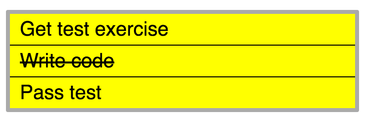

# Тестовое задание #1

## Задание
Частично реализовать ToDo лист. Массив строк, которые нужно отобразить, находится в файле `main.js`. Писать код нужно в том же файле. Список должен быть помещен в элемент `<ul id="app"></ul>`, который уже есть в HTML. Конечный результат должен выглядеть как на изображении ниже. JavaScript и CSS уже подключены в HTML.

## Требования
- Отобразить список строк
- При нажатии на элемент списка текст должен стать перечеркнутым
- При нажатии на элемент с перечеркнутым текстом текст должен вернуться в изначальное представление
- Писать на чистом JavaScript (без jQuery и пр.)
